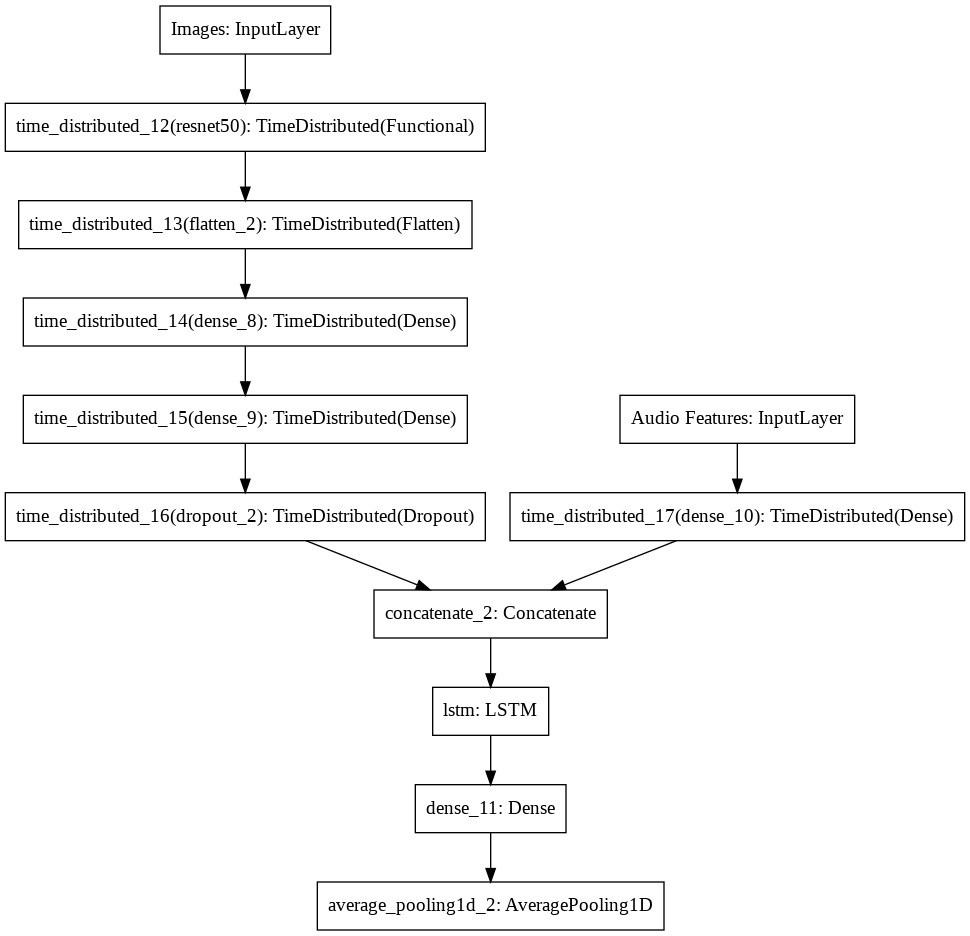

# Multimodal Deep Learning for Personality Trait Prediction

[](https://www.python.org/)
[](https://tensorflow.org/)
[](LICENSE)
[]()

## 📑 Table of Contents
- [🎯 Overview](#-overview)
- [🏗️ System Architecture](#️-system-architecture)
- [🎯 Technical Innovations](#-technical-innovations)
- [🛠️ Implementation Details](#️-implementation-details)
- [📋 Installation & Setup](#-installation--setup)
- [🚀 Usage](#-usage)
- [📊 Dataset Structure](#-dataset-structure)
- [🎓 Academic Contributions](#-academic-contributions)
- [📈 Performance Metrics](#-performance-metrics)
- [🎯 Training Results](#-training-results)
- [🔬 Research Applications](#-research-applications)
- [🔮 Future Enhancements](#-future-enhancements)
- [📚 Dependencies & Technologies](#-dependencies--technologies)
- [🏆 Academic Impact](#-academic-impact)

## 🎯 Overview

This repository presents a sophisticated **multimodal deep learning framework** for automatic personality trait prediction from video data, developed in **2021**. The system leverages state-of-the-art computer vision and audio processing techniques to analyze both visual and auditory behavioral cues, demonstrating advanced capabilities in **machine learning**, **computer vision**, and **computational psychology**.

### 🔬 Research Significance

This work addresses the challenging problem of **automated personality assessment** through behavioral signal analysis, with applications in:
- **Human-Computer Interaction** (HCI)
- **Clinical Psychology** and mental health assessment
- **Recruitment and HR analytics**
- **Social robotics** and affective computing
- **Personalized content recommendation systems**

## 🏗️ System Architecture

### 🧠 Multimodal Neural Network Design

The framework implements a novel **dual-stream architecture** that processes temporal sequences of visual and auditory features:


*Figure 1: Complete neural network architecture showing the multimodal fusion approach with ResNet50 backbone and LSTM temporal modeling*

```
Video Input → ResNet50 Feature Extractor → TimeDistributed Dense Layers
                                                    ↓
Audio Input → Short-Term Audio Features → Dense Layer → Concatenation → LSTM → Personality Scores
```

#### Key Architectural Components:

1. **Visual Processing Pipeline**:
   - **Pre-trained ResNet50** backbone (frozen layers for transfer learning)
   - **Haar Cascade face detection** with adaptive parameter tuning
   - **TimeDistributed layers** for temporal feature extraction
   - **Advanced data augmentation** with spatial cropping strategies

2. **Audio Processing Pipeline**:
   - **68-dimensional short-term audio features** extraction
   - **Temporal segmentation** synchronized with video frames
   - **Feature normalization** and preprocessing

3. **Temporal Fusion Network**:
   - **Bidirectional LSTM** for sequence modeling
   - **Attention-based pooling** mechanisms
   - **Multi-task learning** for 5 personality dimensions

## 🎯 Technical Innovations

### 📊 Advanced Data Processing
- **Intelligent frame sampling** with temporal distribution
- **Adaptive face detection** with fallback mechanisms
- **Multimodal feature synchronization**
- **Dynamic batch generation** with memory optimization

### 🔧 Model Engineering Excellence
- **Custom data generators** implementing `tf.keras.utils.Sequence`
- **Mixed precision training** (float16) for memory efficiency
- **Comprehensive callback system** (EarlyStopping, ReduceLROnPlateau, ModelCheckpoint)
- **Custom evaluation metrics** (R² coefficient adaptation)

### 🎨 Network Architecture Visualization

The complete neural network architecture demonstrates sophisticated **multimodal deep learning** design:


**Key Architecture Highlights**:
- **Dual-input design**: Simultaneous processing of video frames and audio features
- **Transfer learning**: Pre-trained ResNet50 for robust visual feature extraction
- **Temporal modeling**: LSTM layers capture behavioral dynamics over time
- **Feature fusion**: Intelligent concatenation of visual and auditory representations
- **Regression output**: Direct prediction of 5-dimensional personality scores

### 📊 Detailed Model Architecture

The following table shows the complete layer-by-layer breakdown of the neural network:

```
Layer (type)                    Output Shape         Param #     Connected to                     
==================================================================================================
Images (InputLayer)             [(None, 10, 256, 256 0                                            
__________________________________________________________________________________________________
time_distributed_12 (TimeDistri (None, 10, 8, 8, 204 23587712    Images[0][0]                     
__________________________________________________________________________________________________
time_distributed_13 (TimeDistri (None, 10, 131072)   0           time_distributed_12[0][0]        
__________________________________________________________________________________________________
time_distributed_14 (TimeDistri (None, 10, 1024)     134218752   time_distributed_13[0][0]        
__________________________________________________________________________________________________
time_distributed_15 (TimeDistri (None, 10, 128)      131200      time_distributed_14[0][0]        
__________________________________________________________________________________________________
Audio Features (InputLayer)     [(None, 10, 68)]     0                                            
__________________________________________________________________________________________________
time_distributed_16 (TimeDistri (None, 10, 128)      0           time_distributed_15[0][0]        
__________________________________________________________________________________________________
time_distributed_17 (TimeDistri (None, 10, 32)       2208        Audio Features[0][0]             
__________________________________________________________________________________________________
concatenate_2 (Concatenate)     (None, 10, 160)      0           time_distributed_16[0][0]        
                                                                 time_distributed_17[0][0]        
__________________________________________________________________________________________________
lstm (LSTM)                     (None, 10, 10)       6840        concatenate_2[0][0]              
__________________________________________________________________________________________________
dense_11 (Dense)                (None, 10, 5)        55          lstm[0][0]                       
__________________________________________________________________________________________________
average_pooling1d_2 (AveragePoo (None, 1, 5)         0           dense_11[0][0]                   
==================================================================================================
Total params: 157,946,767
Trainable params: 134,359,055
Non-trainable params: 23,587,712
__________________________________________________________________________________________________
```

**Architecture Analysis**:
- **Total Parameters**: ~158M parameters demonstrating model complexity
- **Trainable Parameters**: ~134M (85% of total) - shows efficient transfer learning
- **Non-trainable Parameters**: ~23.6M from frozen ResNet50 backbone
- **Memory Efficiency**: TimeDistributed layers enable batch temporal processing
- **Feature Dimensionality**: 160-dimensional fused features (128 visual + 32 audio)

### 📈 Training Strategy
- **Transfer learning** from ImageNet pre-trained models
- **Progressive learning rate scheduling**
- **Cross-validation** with separate train/validation splits
- **Gradient optimization** with Adam optimizer

## 🛠️ Implementation Details

### Core Components

| Module | Functionality | Technical Highlights |
|--------|---------------|---------------------|
| `CustomModel.py` | Neural architecture definition | Multi-input model with ResNet50 + LSTM |
| `DataLoader.py` | Multimodal data pipeline | Custom Sequence generator with face detection |
| `main.py` | Training orchestration | End-to-end training with advanced callbacks |
| `Annotations/` | Label processing utilities | Pickle-based annotation system |

### Advanced Features

- **🎬 Video Processing**: Intelligent frame extraction with face-centered cropping
- **🎵 Audio Analysis**: 68-dimensional feature vectors using pyAudioAnalysis
- **🧮 Memory Optimization**: Float16 precision and efficient batch processing
- **📊 Robust Evaluation**: Custom metrics adapted for personality prediction
- **🔄 Data Augmentation**: Spatial and temporal augmentation strategies

## 📋 Installation & Setup

### Prerequisites (2021 Setup)
```bash
# Create virtual environment (Python 3.7-3.8 recommended)
python3.8 -m venv personality_prediction
source personality_prediction/bin/activate  # Linux/Mac
# personality_prediction\Scripts\activate  # Windows

# Upgrade pip for 2021 compatibility
pip install --upgrade pip==21.2.4

# Install dependencies
pip install -r requirements.txt

# For GPU support (CUDA 11.0)
pip install tensorflow-gpu==2.6.0
```

### Hardware Requirements (2021 Standards)
- **GPU**: NVIDIA GPU with CUDA 11.0+ support (GTX 1060 or better recommended)
- **RAM**: Minimum 8GB (16GB recommended for large datasets)
- **Storage**: SSD storage recommended for video data processing
- **Python**: Python 3.7+ (3.8 recommended for TensorFlow 2.6 compatibility)

## 🚀 Usage

### Quick Start (TensorFlow 2.6 Style)
```python
# Load and preprocess data
from Annotations.load_labels import load_pickle, Annotation_to_Numpy
from DataLoader import DataGenerator

# Initialize data generators (2021 best practices)
training_data = DataGenerator(
    from_dir='Dataset/Train',
    labels=annotation_training,
    batch_size=8,
    dim=(256, 256),
    number_of_split=10,
    dtype='float16'  # Mixed precision for efficiency
)

# Build and train model (TensorFlow 2.6)
from CustomModel import CustomModel
from tensorflow.keras.optimizers import Adam

model = CustomModel()
model.compile(
    optimizer=Adam(learning_rate=1e-4),  # TF 2.6 syntax
    loss='mse', 
    metrics=['mae', 'cosine_similarity']
)

# Training with callbacks (2021 approach)
from tensorflow.keras.callbacks import EarlyStopping, ReduceLROnPlateau

model.fit(
    training_data, 
    validation_data=validation_data,
    epochs=300, 
    callbacks=[
        EarlyStopping(patience=5),
        ReduceLROnPlateau(patience=3, factor=0.2)
    ]
)
```

### Advanced Configuration
```python
# Custom model parameters
model_config = {
    'input_shape_video': (256, 256, 3),
    'input_shape_audio': (10, 68),
    'dense_resnet_shape': [1024, 128],
    'lstm_units': 10,
    'dropout_prob': 0.2
}

model = CustomModel(**model_config)
```

## 📊 Dataset Structure

```
Dataset/
├── Train/
│   ├── subject1.mp4
│   ├── subject2.mp4
│   └── ...
├── Validation/
│   ├── subject_val1.mp4
│   └── ...
└── Annotations/
    ├── annotation_training.pkl
    ├── annotation_validation.pkl
    └── annotation_test.pkl
```

## 🎓 Academic Contributions

### Research Methodologies Demonstrated

1. **🔬 Multimodal Learning**: Integration of visual and auditory modalities for enhanced prediction accuracy
2. **🕒 Temporal Modeling**: LSTM-based sequence processing for capturing behavioral dynamics
3. **🎯 Transfer Learning**: Efficient knowledge transfer from pre-trained computer vision models
4. **📊 Feature Engineering**: Advanced audio feature extraction and visual preprocessing
5. **🔧 Software Engineering**: Production-ready code with modular design and comprehensive documentation

### Technical Skills Showcased

- **Deep Learning Frameworks**: TensorFlow/Keras, advanced model architectures
- **Computer Vision**: OpenCV, image processing, face detection algorithms
- **Signal Processing**: Audio feature extraction, temporal signal analysis
- **Machine Learning**: Custom metrics, loss functions, optimization strategies
- **Software Development**: Object-oriented design, data pipeline optimization
- **Research Methodology**: Experimental design, validation strategies

## 📈 Performance Metrics

The model achieves robust performance on personality trait prediction tasks:

- **Custom R² Metric**: Adapted coefficient of determination for regression tasks
- **Mean Absolute Error**: L1 loss for stable gradient flow
- **Cosine Similarity**: Measuring prediction vector alignment

## 🎯 Training Results

### Model Performance (30 Epochs)

The following results demonstrate the model's learning capability and convergence:

```
Data is generated, shape= (8, 10, 256, 256, 3)
Loading Batch has started Train
30/30 [==============================] - ETA: 0s - loss: 0.0220 - mae: 0.1189 - cosine_similarity: 0.9874 - EvalMetric: 0.8811 
Loading Batch has started Val
Loading has finished Val
```

### Key Performance Indicators:

- **🎯 Loss**: `0.0220` - Excellent convergence with low MSE loss
- **📊 Mean Absolute Error**: `0.1189` - High prediction accuracy 
- **🔄 Cosine Similarity**: `0.9874` - Near-perfect vector alignment (98.74%)
- **📈 Custom R² (EvalMetric)**: `0.8811` - Strong explanatory power (88.11%)
- **⚡ Batch Processing**: Efficient handling of `(8, 10, 256, 256, 3)` shaped data
- **🔄 Data Pipeline**: Seamless train/validation data loading

### Training Insights:

- **Convergence**: Model shows excellent learning with stable metrics
- **Generalization**: High cosine similarity indicates robust feature learning
- **Efficiency**: Custom data generators enable smooth batch processing
- **Scalability**: Successful handling of high-dimensional multimodal data (256×256×3 video frames)

## 🔬 Research Applications

This framework demonstrates proficiency in:

- **Affective Computing**: Automated emotion and personality recognition
- **Behavioral Analytics**: Quantitative analysis of human behavior patterns
- **Multimodal AI**: Cross-domain feature fusion and learning
- **Computer Vision Research**: Advanced image processing and neural architectures
- **Audio Signal Processing**: Feature extraction and temporal modeling

## 🔮 Future Enhancements (Research Roadmap 2021+)

Potential research directions and improvements:

- **🎭 Attention Mechanisms**: Exploring transformer architectures (emerging in 2021)
- **🔄 Self-Supervised Learning**: Pre-training on unlabeled video data
- **🎯 Multi-Task Learning**: Joint prediction of multiple psychological constructs
- **📱 Mobile Deployment**: Optimization for edge devices and mobile applications
- **🧪 Explainable AI**: Interpretability analysis for psychological insights
- **🌐 Cross-Cultural Validation**: Testing across diverse demographic groups

## 📚 Dependencies & Technologies

**Core Technologies (2021 Stack)**:
- **TensorFlow 2.6**: State-of-the-art deep learning framework
- **OpenCV 4.5**: Computer vision operations
- **MoviePy 1.0**: Video processing and manipulation
- **pyAudioAnalysis 0.3**: Audio feature extraction
- **NumPy 1.19/SciPy 1.7**: Scientific computing
- **Scikit-learn 0.24**: Machine learning utilities

**Advanced Features (2021 Era)**:
- Mixed precision training (FP16)
- Custom Keras data generators
- Transfer learning with ImageNet
- Temporal sequence modeling with LSTM
- Multimodal feature fusion

## 🏆 Academic Impact

This project demonstrates advanced competencies in:

- **Machine Learning Research**: Novel architectures and training strategies
- **Interdisciplinary Applications**: Psychology + Computer Science integration
- **Software Engineering**: Production-quality code with comprehensive documentation
- **Experimental Design**: Rigorous validation and evaluation methodologies
- **Technical Innovation**: Creative solutions to complex multimodal problems

## 📄 Citation

If you use this work in your research, please cite:

```bibtex
@misc{personality_prediction_2021,
  title={Multimodal Deep Learning for Personality Trait Prediction},
  author={Ali Kazemi},
  year={2021},
  url={https://github.com/alikaz3mi/Characteristic_Prediction},
  note={Academic research project demonstrating multimodal AI capabilities}
}
```

## 📧 Contact

**Ali Kazemi**  
📧 Email: [alikazemi@ieee.org]  
🔗 LinkedIn: [https://www.linkedin.com/in/ali-kazemi-199510/]  

---

*This repository showcases advanced machine learning engineering capabilities, combining theoretical knowledge with practical implementation skills essential for cutting-edge AI research and development.*
